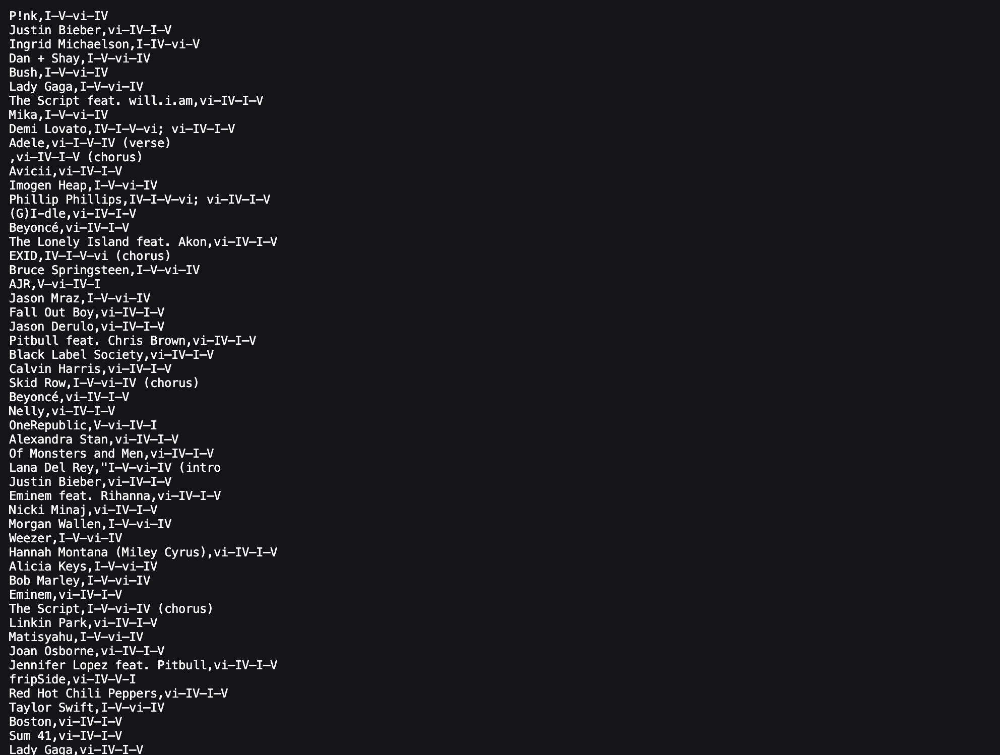

# Cutter_Tool

The cut tool is a command-line utility that extracts specified sections (fields, bytes, or characters) from each line of input text based on a delimiter. It is commonly used to select columns or portions of text from files or streams in Unix-like systems, enabling easy text processing and data extraction.

## Getting Started

Follow these instructions to get a copy of the project up and running on your local machine.

### Prerequisites

- Python 3.x installed

### Installation

Clone the repository to your local machine:

git clone :https://github.com/OmRaj6666/Cutter_Tool.git

IDE: VS CODE

### Usage

To run the tool in the terminal, use the following command:

python Cut.py -f 1,3 sample.tsv
bython Cut-py -f 2,4 -d ',' fourchords. csv

You will be need as your choice alredy it comes with predefined fine change as per need in file and directory to upload any `..test` file and CSV FILE.

## Contributing

Contributions are welcome! Feel free to open issues or submit pull requests to improve functionality or add features.

## License

This project is open source and available under the MIT License.

---
